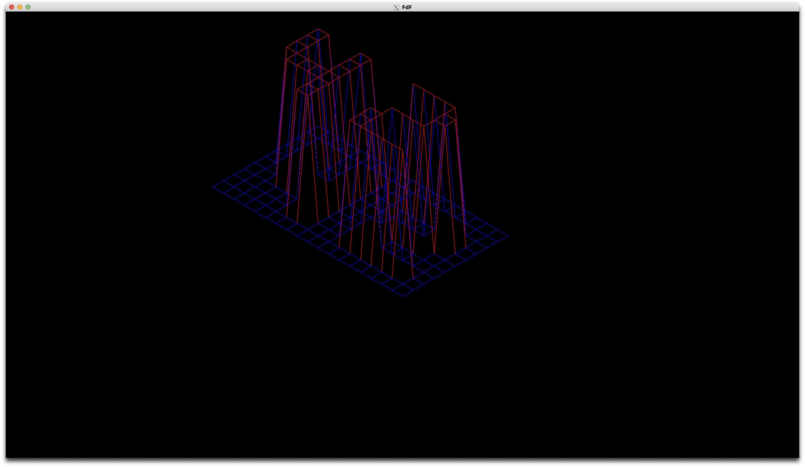

# FdF

MiniLibXを使用してハイトマップデータを等角投影ワイヤーフレームとして描画する3D可視化プログラムです。

## スクリーンショット



*`maps/42.fdf` を実行した結果 - 42ロゴの等角投影ワイヤーフレーム表示*

## 概要

FdFは42 Schoolのプロジェクトで、標高データを含む`.fdf`マップファイルから美しい3Dワイヤーフレーム表現を作成します。プログラムは等角投影を使用して2Dハイトマップをインタラクティブな3D可視化に変換します。

## 機能

- **3Dワイヤーフレーム描画**: 2Dハイトマップを3D等角投影ワイヤーフレームに変換
- **カラーサポート**: マップファイル内の16進数カラーコード（0xRRGGBB形式）をサポート
- **ピクセル完璧なライン**: Bresenhamアルゴリズムを使用したスムーズなライン描画
- **インタラクティブ操作**: ESCキーでプログラム終了
- **設定可能なディスプレイ**: 1920x1080ウィンドウでスケールと投影調整可能

## インストール

```bash
git clone https://github.com/perro1214/42_FdF.git
cd 42_FdF
make
```

## 使用方法

```bash
./fdf maps/42.fdf
```

プログラムは`.fdf`マップファイルを入力として受け取ります。テストマップは`maps/`ディレクトリに提供されています。

### マップファイル形式

```
0  0  0  0  0  0  0  0  0  0  0  0  0  0  0  0  0  0  0
0  0  0  0  0  0  0  0  0  0  0  0  0  0  0  0  0  0  0
0  0 10 10  0  0 10 10  0  0  0 10 10 10 10 10  0  0  0
0  0 10 10  0  0 10 10  0  0  0  0  0  0  0 10 10  0  0
0  0 10 10  0  0 10 10  0  0  0  0  0  0  0 10 10  0  0
```

オプションのカラー形式:
```
0  0  0  0,0xFF0000  0  0  0
0  0  0  0,0x00FF00  0  0  0
```

## ビルドコマンド

- `make` - 実行ファイルをビルド
- `make clean` - オブジェクトファイルを削除
- `make fclean` - オブジェクトファイルと実行ファイルを削除
- `make re` - クリーンして再ビルド
- `make norm` - norminetteスタイルチェッカーを実行

## アーキテクチャ

### 主要コンポーネント

- **マップ解析**: get_next_lineで`.fdf`ファイルを読み込み
- **3D投影**: 等角投影変換システム
- **レンダリングエンジン**: ワイヤーフレーム描画用Bresenhamライン算法
- **イベント処理**: キーボードとウィンドウ管理

### 主要ファイル

- `src/main.c` - プログラムエントリーポイントとメインループ
- `src/parse.c` - マップファイル解析と検証
- `src/draw.c` - ライン描画付きレンダリングエンジン
- `src/hooks.c` - イベント処理とユーザー入力
- `src/utils.c` - 3D投影とカラーユーティリティ

### 依存関係

- **libft/**: カスタムCライブラリ
- **get_next_line/**: ファイル読み込みユーティリティ
- **mlx/**: MiniLibXグラフィックライブラリ

## 操作方法

- **ESC**: プログラム終了

## 技術詳細

- ウィンドウ解像度: 1920x1080
- デフォルトスケール: グリッド単位あたり20.0ピクセル
- 投影: 約30度の等角投影
- ライン算法: アンチエイリアス描画用Bresenham

## プロジェクト構造

```
42_FdF/
├── Makefile           # メインビルド設定
├── README.md          # このファイル
├── include/
│   └── fdf.h          # メインヘッダーファイル（構造体、関数宣言）
├── src/               # ソースコードディレクトリ
│   ├── main.c         # プログラムエントリーポイント
│   ├── parse.c        # マップファイル解析
│   ├── parse_utils.c  # 解析用ユーティリティ関数
│   ├── init.c         # MLX初期化とデフォルトパラメータ
│   ├── draw.c         # レンダリングエンジン（Bresenhamアルゴリズム）
│   ├── hooks.c        # キーボード・ウィンドウイベント処理
│   ├── utils.c        # 3D投影とカラー処理
│   ├── utils2.c       # 追加ユーティリティ関数
│   └── cleanup.c      # メモリ管理とクリーンアップ
├── maps/              # テスト用マップファイル
│   ├── 42.fdf         # 42ロゴマップ
│   ├── julia.fdf      # フラクタルパターン
│   ├── mars.fdf       # 火星地形
│   ├── pyramide.fdf   # ピラミッド形状
│   └── ...            # その他のテストマップ
├── libft/             # カスタムCライブラリ
│   ├── Makefile       # libftビルド設定
│   ├── libft.h        # libftヘッダー
│   ├── ft_*.c         # 標準C関数の実装
│   └── ...
├── get_next_line/     # ファイル読み込みライブラリ
│   ├── Makefile       # get_next_lineビルド設定
│   ├── get_next_line.h
│   ├── get_next_line.c
│   └── get_next_line_utils.c
└── mlx/               # MiniLibXグラフィックライブラリ
    ├── Makefile       # MLXビルド設定
    ├── mlx.h          # MLXヘッダー
    ├── mlx_*.c        # グラフィック機能実装
    ├── man/           # MLXマニュアル
    └── test/          # MLXテストファイル
```

### ファイルの役割

#### 主要ソースファイル
- **main.c**: プログラム開始点、MLXループ設定
- **parse.c**: `.fdf`ファイル解析、グリッド作成
- **init.c**: MLXウィンドウ・画像バッファ初期化
- **draw.c**: ワイヤーフレーム描画、Bresenhamライン実装
- **hooks.c**: キーボード入力（ESC）とウィンドウ終了処理
- **utils.c**: 3D等角投影計算、カラー補間
- **cleanup.c**: メモリ解放、リソース管理

#### 依存ライブラリ
- **libft/**: `ft_split`, `ft_atoi`等の基本C関数
- **get_next_line/**: ファイル1行ずつ読み込み
- **mlx/**: ウィンドウ作成、画像処理、イベント管理

#### テストマップ
- **42.fdf**: 42スクールロゴの形状
- **julia.fdf**: ジュリア集合フラクタル
- **mars.fdf**: 火星表面地形データ
- **pyramide.fdf**: ピラミッド3D形状

## ライセンス

このプロジェクトは42 Schoolカリキュラムの一部です。
